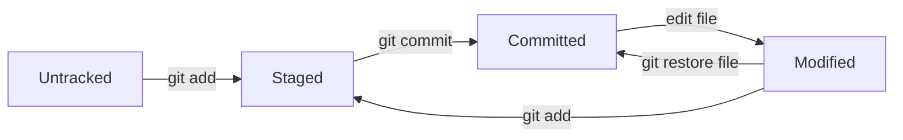

# 01 - Foundations

## Goals
- Understand what Git tracks and why.
- Learn the three states: working tree, staging area, and commit history.
- Make clean commits with meaningful messages.

## Core concepts
- Repository: project history database plus working files.
- Commit: a snapshot of tracked files and metadata.
- Branch: a movable pointer to a commit.
- Remote: hosted copy of your repository (for example, GitHub).

## Install and setup
```bash
git --version
git config --global user.name "Your Name"
git config --global user.email "you@example.com"
git config --global init.defaultBranch main
git config --global core.editor "code --wait"
```

## First repository flow
```bash
mkdir hello-git && cd hello-git
git init
echo "# Hello Git" > README.md
git status
git add README.md
git commit -m "feat: initialize repository with README"
git log --oneline
```

## File lifecycle


## Commands to know now
```bash
git status
git add <file>
git commit -m "message"
git log --oneline --graph --decorate
git diff
git restore <file>
git rm <file>
```

## Good commit message pattern
- Type + scope + intent.
- Example: `fix(parser): handle empty input`.

## Common beginner mistakes
- Forgetting to stage files before commit.
- Committing unrelated changes together.
- Using vague commit messages like "update".

## Quick self-check
- Can you explain staged vs committed?
- Can you recover a modified file with restore?
- Can you read a simple one-line log?
