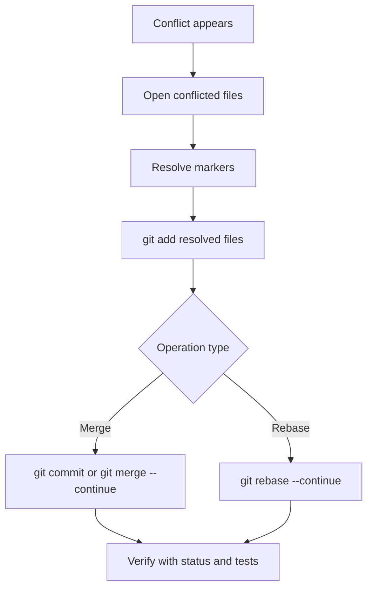

# 05 - Troubleshooting and Recovery

## Goals
- Diagnose common Git errors quickly.
- Recover work after mistakes.
- Choose the right recovery command.

## Common scenarios

### I committed to the wrong branch
```bash
git log --oneline -n 3
git switch correct-branch
git cherry-pick <commit_sha>
git switch wrong-branch
git reset --hard HEAD~1
```

### I need to undo my last commit but keep changes
```bash
git reset --soft HEAD~1
```

### I need to discard local file changes
```bash
git restore <file>
```

### I deleted a branch and need it back
```bash
git reflog
git switch -c recovered-branch <sha>
```

### Merge conflict recovery quick flow


## Error message translation
- non-fast-forward: your branch is behind remote; fetch and integrate.
- detached HEAD: you checked out a commit, not a branch.
- merge conflict: both sides changed overlapping lines.

## Recovery decision guide
1. Lost commits: use reflog.
2. Bad recent commit: use reset (soft or mixed).
3. Wrong file content: use restore.
4. Need to reverse a pushed commit: use revert.

## Safer alternatives to destructive actions
- Prefer revert for shared branches.
- Prefer backup branch before reset --hard.
