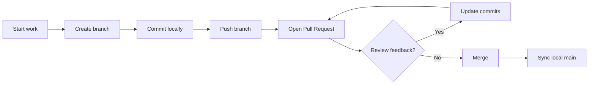

# Git Learning Path (Beginner to Advanced)

A practical, modular guide for learning Git from scratch and growing into advanced workflows.

## Suggested use
- Follow modules in order from 01 to 05.
- Keep 06 open as your quick command reference.
- Use the flow diagrams when you need to decide between merge/rebase/cherry-pick.

## Audience
- Mixed learners: beginners to intermediate developers.
- GitHub-focused examples with CLI-first commands.

## Learning map
1. [01 - Foundations](01-foundations.md)
2. [02 - Daily Workflows](02-daily-workflows.md)
3. [03 - Collaboration on GitHub](03-collaboration-github.md)
4. [04 - Advanced Techniques](04-advanced-techniques.md)
5. [05 - Troubleshooting and Recovery](05-troubleshooting-recovery.md)
6. [06 - Cheat Sheet](06-cheat-sheet.md)

## Visual workflow

## Study outcomes
By the end of this path, learners should be able to:
- Create and manage repositories confidently.
- Use branches, merges, and rebases safely.
- Collaborate via pull requests and reviews on GitHub.
- Recover from common mistakes using reflog, reset, and restore.
- Debug history problems with bisect and clean commit practices.
