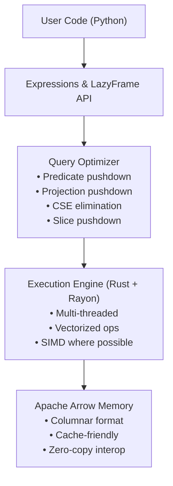

# Polars Comprehensive Tutorial

A complete guide to Polars — from fundamentals to advanced data manipulation techniques.

## Table of Contents

- [What is Polars?](#what-is-polars)
- [Architecture Overview](#architecture-overview)
- [Installation & Setup](#installation--setup)
- [Core Concepts](#core-concepts)
- [Quick Reference](#quick-reference)
- [Performance Best Practices](#performance-best-practices)
- [Polars vs Pandas vs PySpark](#polars-vs-pandas-vs-pyspark)
- [Resources](#resources)

---

## What is Polars?

Polars is a blazingly fast DataFrame library written in Rust with first-class Python bindings. It provides:

- **Speed**: Multi-threaded execution using all CPU cores by default
- **Memory Efficiency**: Apache Arrow columnar memory format, zero-copy interop
- **Lazy Evaluation**: Query optimization (predicate/projection pushdown) before execution
- **Expressive API**: Composable expressions, no index, strict typing
- **Streaming**: Process datasets larger than RAM

---

## Architecture Overview



---

## Installation & Setup

```bash
# Using uv (this project)
uv add polars

# Or with pip
pip install polars

# With optional features
pip install 'polars[all]'        # All optional deps
pip install 'polars[numpy]'      # NumPy interop
pip install 'polars[pandas]'     # Pandas interop
pip install 'polars[pyarrow]'    # PyArrow interop
```

---

## Core Concepts

### 1. Eager vs Lazy Execution

| Mode | Entry Point | When to Use |
|------|-------------|-------------|
| **Eager** | `pl.DataFrame(...)` | Interactive exploration, small data |
| **Lazy** | `df.lazy()` / `pl.scan_*()` | Production pipelines, large data |

### 2. Expressions

Expressions are the core building block. They describe computations on columns:

```python
# Expressions are composable
expr = pl.col("price") * pl.col("quantity")  # multiply columns
expr = pl.col("name").str.to_uppercase()  # string operations
expr = pl.col("date").dt.year()  # temporal operations
```

### 3. Contexts

Expressions are used in specific contexts:

| Context | Method | Purpose |
|---------|--------|---------|
| Select | `.select()` | Choose/transform columns |
| Filter | `.filter()` | Filter rows |
| With Columns | `.with_columns()` | Add/modify columns |
| Group By | `.group_by().agg()` | Aggregate |

### 4. No Index

Unlike Pandas, Polars has no index. Operations are explicit:
- No hidden alignment by index
- Joins require explicit `on` keys
- Row order is preserved unless explicitly sorted

---

## Quick Reference

### Creating DataFrames

```python
# From dict
df = pl.DataFrame({"a": [1, 2, 3], "b": ["x", "y", "z"]})

# From CSV/Parquet (eager)
df = pl.read_csv("data.csv")
df = pl.read_parquet("data.parquet")

# From CSV/Parquet (lazy — preferred for large files)
lf = pl.scan_csv("data.csv")
lf = pl.scan_parquet("data.parquet")
```

### Selecting & Filtering

```python
# Select columns
df.select("col1", "col2")
df.select(pl.col("price") * 1.1)

# Filter rows
df.filter(pl.col("age") > 30)
df.filter(pl.col("state").is_in(["NY", "CA"]))
```

### Aggregations

```python
df.group_by("category").agg(
    pl.len().alias("count"),
    pl.col("price").mean().alias("avg_price"),
    pl.col("price").sum().alias("total"),
)
```

### Window Functions

```python
# Polars uses .over() instead of SQL OVER(PARTITION BY ...)
df.with_columns(
    pl.col("price").mean().over("category").alias("cat_avg"),
    pl.col("price").rank().over("category").alias("rank"),
    pl.col("amount").cum_sum().over("customer").alias("running_total"),
)
```

### Joins

```python
df1.join(df2, on="key", how="inner")  # inner, left, right, full
df1.join(df2, on="key", how="anti")  # rows NOT in df2
df1.join(df2, on="key", how="semi")  # rows IN df2 (no columns from df2)
```

### Conditional Expressions

```python
pl.when(pl.col("x") > 0).then(pl.lit("pos")).otherwise(pl.lit("neg"))
```

---

## Performance Best Practices

| Practice | Impact |
|----------|--------|
| Use native expressions over `map_elements` | 10-100x faster |
| Use lazy mode for pipelines | Enables optimizer |
| Prefer `scan_parquet` over `read_csv` | Predicate/projection pushdown |
| Use `sink_parquet` for large outputs | Avoids materializing in memory |
| Use `streaming=True` for large data | Processes in chunks |
| Avoid Python UDFs | Breaks vectorization |
| Use `pl.selectors` for column selection | Cleaner, dynamic code |
| Cast to smallest viable dtype | Reduces memory |

---

## Polars vs Pandas vs PySpark

| Aspect | Polars | Pandas | PySpark |
|--------|--------|--------|---------|
| **Engine** | Rust (multi-threaded) | C/Cython (single-threaded) | JVM (distributed) |
| **Scale** | Single machine (GBs-100s GB) | Single machine (GBs) | Cluster (TBs) |
| **Lazy eval** | Built-in | No (Pandas 2.0 partial) | Always |
| **Memory** | Arrow columnar | NumPy arrays | JVM heap |
| **Index** | No | Yes | No |
| **Startup** | Instant | Instant | Slow (JVM) |
| **API style** | Expressions | Method chaining / indexing | DataFrame API + SQL |
| **Null handling** | First-class null | NaN/None mixed | Null |
| **Nested types** | Native List/Struct | Object dtype | Schema-defined |

### When to Use Each

- **Polars**: Single machine, need speed, data fits in memory (or use streaming)
- **Pandas**: Legacy code, ecosystem integrations, small data exploration
- **PySpark**: Truly distributed data (TBs+), cluster infrastructure available

---

## Resources

- [Polars Documentation](https://docs.pola.rs/)
- [Polars User Guide](https://docs.pola.rs/user-guide/)
- [Polars API Reference](https://docs.pola.rs/api/python/stable/reference/)
- [Polars GitHub](https://github.com/pola-rs/polars)
- [Polars Cookbook](https://docs.pola.rs/user-guide/expressions/)
- [From Pandas to Polars](https://docs.pola.rs/user-guide/migration/pandas/)
